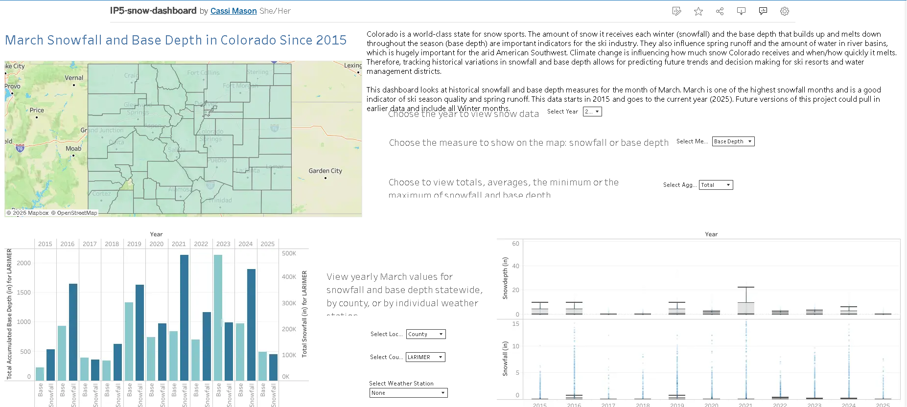
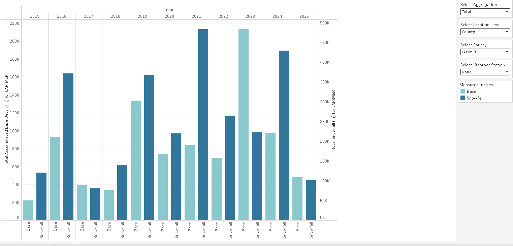
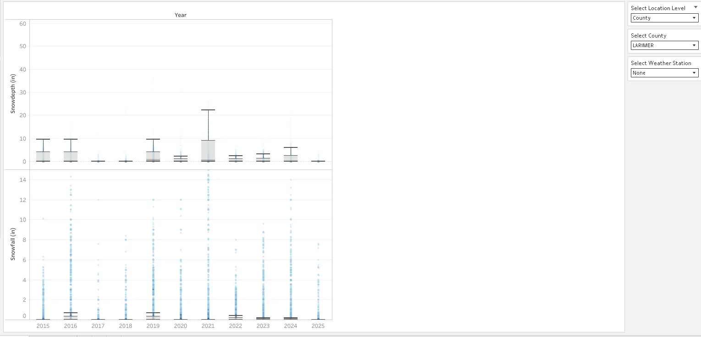
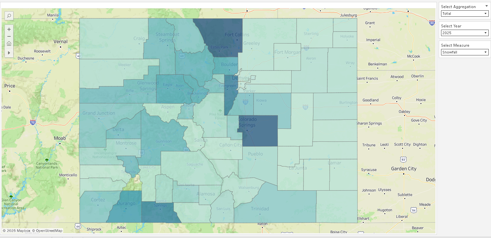
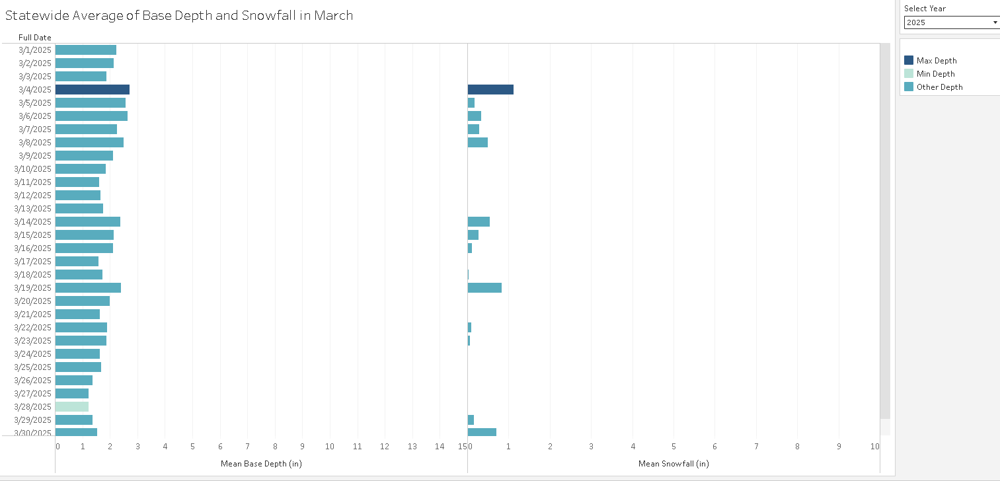

# **Colorado Snow Data Dashboard**

An interactive Tableau dashboard visualizing historical snowfall and snow depth trends across Colorado.

## **Description**

### Background
As a ski/snowboard instructor, I have a direct personal and professional stake in Colorado's snowpack trends. NOAA maintains daily snowfall and snow depth records for thousands of U.S. weather stations, but the raw data is split across yearly files in an inconsistent format, making historical trends hard to see at a glance.

### What this project does
This project cleans and transforms ten years of NOAA snow monitoring data (2015–2025) for Colorado and turns it into an interactive Tableau dashboard, letting users explore snowfall and snow depth trends by year, county, and weather station.
_Note: Data is limited to March each year, as a proof of concept and because March is generally a high-snow month and a useful proxy for spring runoff._

### Impact
The dashboard explores year-to-year and regional variation in snowpack that's hard to see in raw station data, which is relevant to the ski industry and to the ecology and water resource planning of the Colorado River Basin, particularly in the context of climate change.

## **Demo**

**[View the live dashboard on Tableau Public](https://public.tableau.com/app/profile/cassandra.mason/viz/IP5-snow-dashboard/Dashboard1)**

## **Data Pipeline**

**Source:** [NOAA Daily U.S. Snowfall and Snow Depth reports](https://www.ncei.noaa.gov/access/monitoring/daily-snow/), filtered to Colorado weather stations, March data only (2015–2025).

1. Loaded each year's raw CSV (snowfall and snow depth reported separately) into Pandas DataFrames, tagging each with its source year.
2. Melted each file from wide to long format, producing a consistent schema: `Year, Station ID, Station Name, Elevation, Longitude, Latitude, County, State, Date, Measure`.
3. Combined years into two master DataFrames — one for snowfall, one for snow depth.
4. Cleaned the data: reformatted dates (`monthAbbreviation dayInteger` → `%d-%b-%Y`), converted missing-value codes (`M`) to `NaN`, and converted trace-amount codes (`T`) to `0`.
5. Exported cleaned DataFrames as CSVs, used as the Tableau data source.

## **Features**
**Integrated dashboard** (Yearly Data View, Box and Whisker Plots, Heat Map):

- Yearly view: dual-axis bar chart of snowfall and snowpack by year, filterable by location level (statewide/county/station) and aggregation (total/average/min/max)

- Box and whisker plots showing the center and distribution of snowfall and snowpack per year, using the same location-level filter as the yearly view

- County-level heat map of snowfall/snow depth intensity for a selected year, with tooltips showing county, year, measure (snowfall or snowpack), and aggregation type

_Note: A fourth visualization — a daily data view for March, averaged across all Colorado weather stations and highlighting the least and most snowfall and snowpack days — exists in the underlying workbook but is not currently published/viewable on Tableau Public. See Known Limitations._

## **Built With**
- Python 3.10
- Pandas
- Tableau Public

## **Project Structure**
- `colorado-snow-data-ETL.ipynb` - data cleaning and transformation pipeline
- `data/` - raw NOAA snowfall and snow depth files by year
- `cleaned_snowfall_data.csv` and `cleaned_snowdepth_data.csv` - cleaned Tableau data sources

## **Known Limitations**
- The daily data view (see Future Features) is built but not published. Tableau Public currently only exposes the integrated dashboard, not standalone sheets
- Selecting a year sometimes triggers a "too much data, try filtering further" warning that doesn't reliably reappear on retry. Filtering/performance issue still being debugged
- Some filter controls overlap dashboard text, and some text boxes are cut off, making certain labels hard to read. Layout cleanup planned
- The dual-axis bar chart uses the same color scheme for the two axes as the heat map uses for intensity, which is confusing. Plan to change to distinct colors with a legend indicating which color belongs to which axis
- The "Weather Station" location-level filter (Yearly View and Box and Whisker Plots) doesn't render any data
- The heat map's base depth calculation isn't working correctly (every county renders at the lightest color, no tooltip value)
- Heat map averages are computed as daily averages rather than full-year/monthly averages, which understates typical values

## **Future Features**
- **Daily view integration**: fold the daily data view into the main dashboard as a pop-up in the heat map tooltip when hovering over a county, rather than a standalone chart
- **Automated data pulls**: script to automatically pull, process, and integrate new NOAA data rather than manual downloads
- **Data engineering**: automatically load cleaned and aggregated data in a database rather than static CSVs, enabling drill-down/roll-up queries and reuse across other analyses beyond this dashboard
- **Full winter season**: extend beyond March to cover the full winter for a more complete seasonal picture
- **Longer historical range**: source data further back than 2015 to better surface long-term climate trends
- **30-year baseline heat map**: showing each year's deviation from a 30-year average, with a diverging color scheme
- **Animated heat maps**: step through years to show snowpack and snowfall trends over time
- **Multi-state coverage**: expand beyond Colorado

## **Acknowledgments**
Originally built for CS479 Data Visualizations at Colorado Technical University in April 2025.

